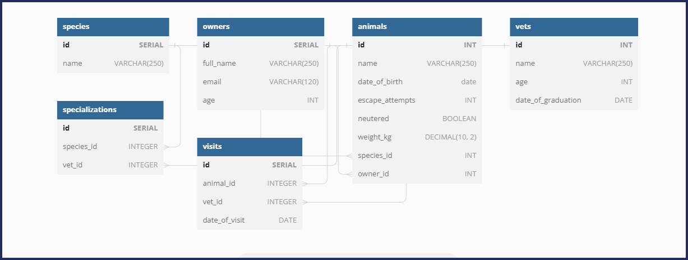

<a name="readme-top"></a>




<!-- TABLE OF CONTENTS -->

<!-- PROJECT DESCRIPTION -->

# 📖 Vet Clinic Database <a name="about-project"></a>

**Vet Clinic Database** is a database created on sql that contains animals data

## 🛠 Built With <a name="built-with"></a>

### Tech Stack <a name="tech-stack"></a>

<details>
<summary>Database</summary>
  <ul>
    <li><a href="https://www.postgresql.org/">PostgreSQL</a></li>
  </ul>
</details>

## 💻 Getting Started <a name="getting-started"></a>

> Describe how a new developer could make use of your project.

To get a local copy up and running, follow these steps.

### Prerequisites

In order to run this project you need to install these prerequisites:

- If you're running on Windows you can download the prerequisites from the links down below:

> [Git](https://git-scm.com/)

- If you're running on Linux follow these steps down below:

- Install git.

```sh
 sudo apt install git
```

### Setup

Clone this repository to your desired folder:

```sh
  git clone git@github.com:Cluab/Vet-clinic-database.git
  cd Vet-clinic-database
```

### Install

Install this project with:

```sh
  postgreSQL
```

### Usage

To run the project, execute the following command:

```sh
  open pg admin 4
```

### Run tests

To run tests, run the following command:

```sh
  create a database called Vet-clinic and code past the code in the query tools section
```

<p align="right">(<a href="#readme-top">back to top</a>)</p>

<!-- AUTHORS -->

## 👥 Authors <a name="authors"></a>

👤 **Ibrahim Suhail Alyousefi**

- GitHub: [Ibrahim Suhail Alyousefi](https://github.com/Cluab)

👤 **Belal Gamal**

- GitHub: [Belal Gamal](https://github.com/belalgamal46)
- LinkedIn: [@belalgamal](https://www.linkedin.com/in/belalgamal/)

<p align="right">(<a href="#readme-top">back to top</a>)</p>

<!-- CONTRIBUTING -->

## 🤝 Contributing <a name="contributing"></a>

Contributions, issues, and feature requests are welcome!

Feel free to check the [issues page](https://github.com/Cluab/Vet-clinic-database/issues).

<p align="right">(<a href="#readme-top">back to top</a>)</p>

<!-- SUPPORT -->

## ⭐️ Show your support <a name="support"></a>

Give a ⭐️ if you like this project!

<p align="right">(<a href="#readme-top">back to top</a>)</p>

<!-- ACKNOWLEDGEMENTS -->

## 🙏 Acknowledgments <a name="acknowledgements"></a>

- I would like to thank Microverse for project inspiration.

<p align="right">(<a href="#readme-top">back to top</a>)</p>

<!-- FAQ (optional) -->

## ❓ FAQ <a name="faq"></a>

- **what does postgreSQL do exactly**

  - PostgreSQL is an open-source relational database management system (RDBMS) that is used to store and manage data in a structured format. It is a powerful, feature-rich and highly extensible database system that can be used for a wide variety of purposes, from small personal projects to large enterprise applications.

<p align="right">(<a href="#readme-top">back to top</a>)</p>

<!-- LICENSE -->

## 📝 License <a name="license"></a>

This project is [MIT](./LICENSE) licensed.

<p align="right">(<a href="#readme-top">back to top</a>)</p>
